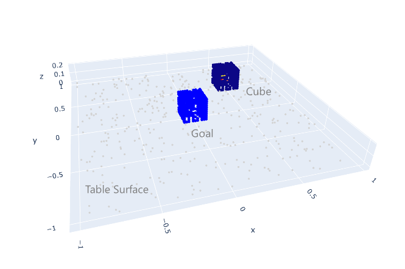
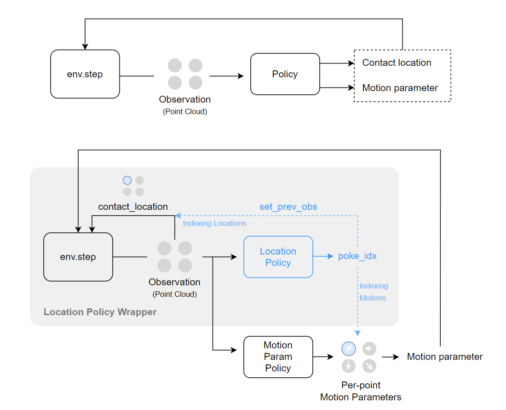

# HACMan

<p align="center">
  
</p>

Code Release for HACMan: Learning Hybrid Actor-Critic Maps for 6D Non-Prehensile Manipulation.

[Website](https://hacman-2023.github.io/) | [Arxiv](https://arxiv.org/abs/2305.03942)

Please feel free to open an issue or email us at {wenxuanz, bowenj}@andrew.cmu.edu if you have any questions.

## Table of Contents
- [HACMan Code Release](#hacman-code-release)
  - [Table of Contents](#table-of-contents)
- [Installation](#installation)
  - [Configure WandB logging](#configure-wandb-logging)
  - [(Optional) HACMan Bin Env Dependencies](#optional-hacman-bin-env-dependencies)
- [Commands](#commands)
  - [Training HACMan on SimpleEnv](#training-hacman-on-simpleenv)
  - [Training HACMan on HACManBinEnv](#training-hacman-on-hacmanbinenv)
  - [Evaluating HACMan on HACManBinEnv](#evaluating-hacman-on-hacmanbinenv)
- [Development](#development)
  - [Code Structure](#code-structure)
  - [Adding New Environments](#adding-new-environments)
  - [Explanation of the hybrid policy](#explanation-of-the-hybrid-policy)
  - [Explanation of the environment wrappers](#explanation-of-the-environment-wrappers)
  - [License](#license)


# Installation

First, install the conda environment:
```
conda env create -f environment.yml
```

Install `Pytorch 1.11.0 + cu113`. Note: the compatibility with other Pytorch version has not been tested.
```
pip install torch==1.11.0+cu113 torchvision==0.12.0+cu113 torchaudio==0.11.0 --extra-index-url https://download.pytorch.org/whl/cu113
```

Install the following packages with **THE SPECIFIED VERSIONS**:
```
# Torch Geometric
pip install torch-scatter==2.0.9 -f https://data.pyg.org/whl/torch-1.11.0+cu113.html
pip install torch-sparse==0.6.15 -f https://data.pyg.org/whl/torch-1.11.0+cu113.html
pip install torch-geometric==2.0.4
pip install torch-cluster==1.6.0 -f https://data.pyg.org/whl/torch-1.11.0+cu113.html
```

Install this package:
```
pip install -e .
```

## Configure WandB logging

Our training script is based on [stablebaselines3](https://github.com/DLR-RM/stable-baselines3), which supports logging with [Weight & Bias](https://wandb.ai/home).

If you do not wish to use WandB, you can turn off streaming by running `wandb off` from your training directory or setting the environment variable `WANDB_MODE=offline`.

To configure the WandB logging function, set the following environment variables. 
```
export WANDB_ENTITY=[your Wandb ID]
export WANDB_PROJECT=[your project name]
```

## (Optional) HACMan Bin Env Dependencies

`HACManBinEnv` is the object pose alignment task shown in our paper. Running this simulation environment requires Mujoco and Robosuite. **Please skip this section if you do not intend to run this task.**

Install `mujoco-py` using the instructions [here](https://github.com/openai/mujoco-py#install-mujoco).

Install our modified verion of `robosuite`.
```
cd robosuite && pip install -e .
```

# Commands

- To verify your installation, try [training HACMan on SimpleEnv](#training-hacman-on-simpleenv). `SimpleEnv` is a simple 2D tabletop cube pushing environment.

- To reproduce the training curves in the paper, see [train HACMan on HACManBinEnv](#training-hacman-on-hacmanbinenv).

Note: if you have correctly configured your WandB logging, you should be able to see the training curve for any of the following training tasks on your W&B project page (note: change the x-axis to `global step`).

## Training HACMan on SimpleEnv

<p align="center">
  
</p>

The following command launches HACMan trining on the task `SimpleEnv`. You should expect a success rate of ~50% at 50k training steps.

```
python scripts/run.py \
--env simple_env \
--algo HybridTD3 
```


## Training HACMan on HACManBinEnv

**Important: make sure you have installed the [HACManBinEnv dependencies](#optional-hacman-bin-env-dependencies).**

<p align="center">
  
</p>

The following command launches HACMan training on the task `HACManBinEnv`. If everything is configured correctly, this should reproduce the performance of our experiment **All Objects 6D Goals** (Fig. 4) in our [paper](https://arxiv.org/pdf/2305.03942.pdf). You should expect a success rate of ~85% at 200k training steps.

```
LD_PRELOAD="" MUJOCO_PY_FORCE_CPU=1 python scripts/run.py \
--env hacman_bin_env \
--clamp_critic_max 0 \
--clamp_critic_min -20 \
--ExpID 1000
```

---

To experiment with other goal configurations, set `goal_mode`. 
```
--goal_mode {GOAL_MODE}
```

The available goal modes are:
- 6d goals: `any_var_size`
- planar goals: `translation`
- upright goals: `upright`

---

To experiment with a specific object, set `object_name` as follows:
```
--object_name {MESH_NAME}
```

You can find the full list of mesh names in `bin_env/assets/housekeep_all/models_processed/meshes/`. For example, `rubiks_cube_077_rubiks_cube_M` is the name of the cube object used in our experiments.

## Evaluating HACMan on HACManBinEnv

**Important: make sure you have installed the [HACManBinEnv dependencies](#optional-hacman-bin-env-dependencies).**

The following command evaluates a trained HACMan policy for 100 episodes. We have provided some checkpoints [here](https://drive.google.com/drive/folders/10CmjAJftzgXqlaK-fhA_7mQ2X6izjUiK?usp=sharing). Download the checkpoint and save it to a directory of your choice (e.g. `scripts/ckpts/`). Then, run the following command to evaluate the policy.

```
LD_PRELOAD="" MUJOCO_PY_FORCE_CPU=1 python scripts/run.py \
--env hacman_bin_env \
--ExpID 1001 \
--gradient_steps 0 \
--initial_timesteps 0 \
--load_ckpt scripts/ckpts/rl_model_200000_steps.zip --eval 100
```

To render the videos, add the following arguments
```
--record_video --record_from_cam agentview
```

# Development

## Code Structure
- `docs`: Documentation files
- `hacman`
  - `algos`
    - `feature_extractors`
      - `feature_extractors.py`: Networks for extracting features from point clouds
    - `hacman_td3.py`: HACMan hybrid TD3 implementation
    - `location_policy.py`: Location policy implementation. Location policies score per-point actions and select the best point to execute the action.
    - `mix_td3.py`: An ablation implementation of HACMan TD3.
    - `setup_model.py`: Model setup functions.
  - `envs`
    - `sim_envs`
      - `base_env.py`: Base class for simulation environments used by HACMan.
      - `simple_env.py`: Simple 2D tabletop cube pushing environment.
      - `hacman_bin_env.py`: HACMan Bin environment.
    - `location_policy_wrappers.py`: Wrappers for location policy used in env. Location policy is included in the env wrapper since we add contact point index part to be part of the environment observation. 
    - `wandb_wrappers.py`: WandB logging wrappers.
    - `setup_envs.py`: Environment setup functions.
    - `setup_location_policy.py`: Location policy setup functions.
  - `networks`
    - `common.py`: Common network modules.
    - `point_transformer.py`: Point Transformer implementation.
    - `pointnet2.py`: PointNet++ implementation.
  - `sb3_utils`: Stable Baselines 3 utilities.
    - ...
  - `utils`
    - `launch_utils.py`: Utility functions for launching training.
    - `plotly_utils.py`: Utility functions for plotting 3D PCD visualizations.
    - `robosuite_transform_utils.py`: Utility functions used by `transformations.py`. Copied from `robosuite`.
    - `transformations.py`: Utility functions for transforming 3D PCDs.
- `scripts`
  - `test_simple_env.py`: Test script for `SimpleEnv`.
  - `run.py`: Training script.
- `bin_env`
  - `assets`: Assets used by `HACManBinEnv`.
    - `housekeep`: Cylindrical housekeep objects.
    - `housekeep_all`: All housekeep objects.
    - ...
  - `controller_configs`: Controller configuration files.
  - `data`
    - `housekeep`: Goal pose data for cylindrical housekeep objects.
    - `housekeep_all`: Goal pose data for all housekeep objects.
  - `base_env.py`: Base environment. It contains initialization functions for the environment and object loading functions.
  - `bin_arena.py`: Bin workspace.
  - `osc.py`: Controller for controlling robot arm via operational space control.
  - `poke_env.py`: Top-level sim environment directly used by `HACManBinEnv`. It contains functions for interacting with the environment, resetting the environment, and setting goals.
  - ...


## Adding New Environments

To create a new environment that inherits from BaseEnv, you will need to define a new class that inherits from `hacman/envs/sim_envs/base_env.py`. Here is an example of what your new class could look like (see `hacman/envs/sim_envs/simple_env.py` for a more complete example):

```
import gym
from hacman.envs.sim_envs.base_env import BaseEnv

class MyCustomEnv(BaseEnv):
    def __init__(self, **kwargs):
        super().__init__(**kwargs)
        self.my_custom_sim = MyCustomSim()

    def step(self, action):
        # Define your custom step function here
        return observation, reward, done, info

    def reset(self):
        # Define your custom reset function here
        return observation
```

For reference, the custom environment will also inherit the following functions from `BaseEnv`:

- `set_prev_obs`: (Required) After an environment step, a location policy computes the location index and stores it back to the environment through this function. The environment uses the computed location index to retrieve contact location in the next step.
- `_evaluate_goal`: By default, HACMan computes the norm of the flow as reward and evaluates the success of task completion.  


Afterwards, add the new environment to `hacman/envs/setup_envs.py`.


## Explanation of the hybrid policy

In the paper, we propose a hybrid action space with a discrete component (action location) and a continuous component (motion parameters). Unfortunately, Stable baselines3 does not support hybrid action space. We design a workaround to incorporate the hybrid action space into Stable baselines3 that can be combined with existing continuous action space algorithms with minimal modifications.

<p align="center">
  
</p>

The main idea is to include the discrete part of the policy (location policy) into the environment as an environment wrapper. As illustrated in the figure below, the raw output of env.step will be passed into a location policy wrapper (implemented as SubprocVecEnvwithLocationPolicy or DummyVecEnvwithLocationPolicy in `hacman/envs/location_policy_wrappers.py`). The location policy then selects the discrete action based on the current model and appends the action as `poke_idx` into the observation. Then, the full observation, including the original observation and `poke_idx`, will be passed into the RL algorithm of Stable baseline3. In addition, we pass the `poke_idx` back to the simulation environment by `set_prev_obs` to be used for the next `env.step`. In this way, the discrete component of the policy is off-loaded into the environment and we can use any algorithm with continuous action space seamlessly.

Note that the wrappers in `hacman/envs/location_policy_wrappers.py` serve as a connection between the environment and the wrapper. The actual "policy" (how we select the discrete action) is defined as `LocationPolicyWithArgmaxQ` in `hacman/algos/location_policy.py`. 


## Explanation of the environment wrappers

This section presents the complete list of environment wrappers employed in this project.

Environment wrappers' order: 
```
VecEnvwithLocationPolicy<[NUM_ENVS * <Monitor<TimeLimit<Env>>]>
```

For evaluation, we add one more wrapper `WandbPointCloudRecorder` on top to record the point cloud visualizations or video footages.

1. `SubprocVecEnvwithLocationPolicy`/`DummyVecEnvwithLocationPolicy`. 
    
    This wrapper embeds the location policy into the environment. It is utilized for both parallel and non-parallel training, where SubprocVecEnvwithLocationPolicy is used for parallel training, and DummyVecEnvwithLocationPolicy is employed for non-parallel training (useful for debugging). These wrappers incorporate the policy model to calculate the poke_idx and action_score, which are appended to the observation using set_prev_obs, as described in the previous section. The poke_idx determines the point where the action is executed, while the action_score is used for logging. The implementations of these wrappers can be found in `hacman/envs/location_policy_wrappers.py`.
2. `Monitor`. 
   
   This wrapper logs the agent's performance during training, providing information on episode reward, episode length, and episode time. These values are subsequently uploaded to wandb. The implementation is imported from `stable_baselines3.common.monitor`.

3. `TimeLimit`. 
   
   This wrapper limits the maximum number of steps per episode. When the episode reaches the maximum number of steps, it sets done to True. The implementation is imported from `gym.wrappers.time_limit`.

4. `WandbPointCloudRecorder`.
   
   This wrapper is used to record and generate point cloud visualizations of episodes and upload them to wandb. Please note that only the first of the parallel environments will have point cloud visualizations. Additionally, it records video footages if enabled. The implementation can be found in `hacman/envs/wandb_wrappers.py`.


## License

HACMan is MIT licensed. See the [license](./LICENSE) for details.
